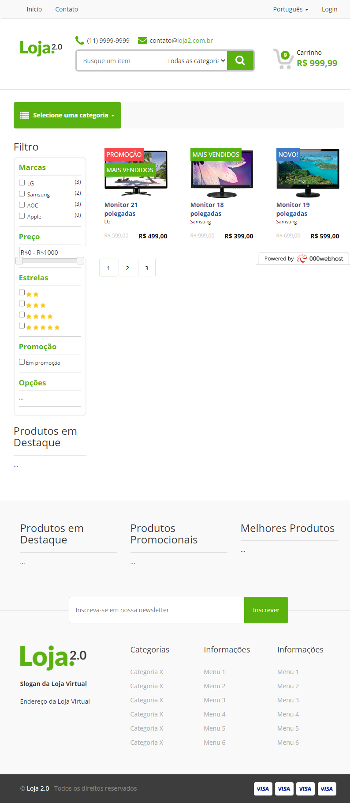

# Loja Virtual 
## Loja Virtual com PHP MVC e MySQL
-----------------------------------
### Ainda em Desenvolvimento

Projeto do Curso de PHP da B7Web, que consiste em uma loja virtual com PHP puro utilizando padrão MVC e banco de dados MySQL.

#### Funcionalidades Extras e Implementações Adicionais

Implementei algumas coisas nesse projeto, que não constam no projeto original

- [x] Uso de Namespaces
- [x] Uso do Composer como gerenciador de dependências
- [x] Uso do padrão PSR-4 para autoload de classes, usando o autoload do Composer

[Visualizar Projeto Online](https://novalojab7web.000webhostapp.com/)

Este curso utiliza a seguinte [estrutura MVC](https://github.com/gustavoalvesdev/estrutura_mvc)

